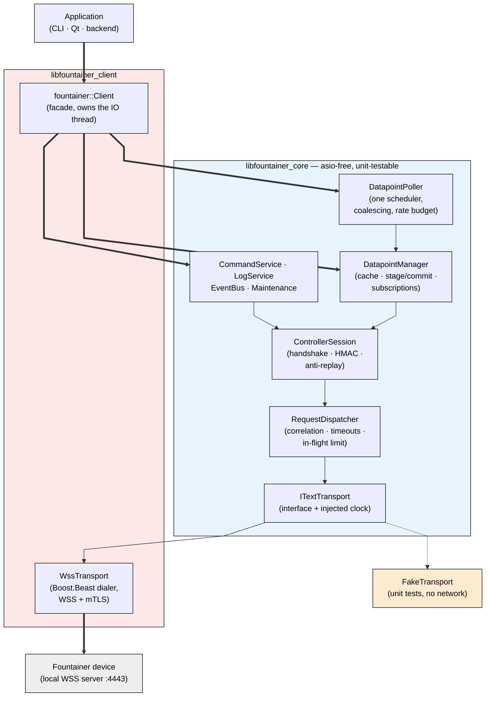
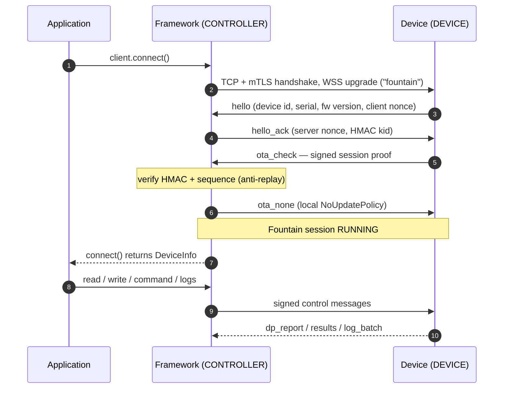
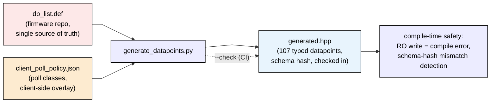

# fountainer_client_framework

C++20 **framework** (Boost.Asio/Beast, OpenSSL, nlohmann-json) for accessing
Fountainer devices (ESP32-S3) over the Fountain v2.2 protocol: locally via
**WSS + mTLS** on port 4443, and later reusable in the backend over accepted
connections.

Firmware counterpart: `fountainer_firmware/src/network/local_server`

Section references like “design concept §N” throughout the code and this
README cite an internal design document that is not part of this repository.

---

## The API in 30 seconds

```cpp
#include <fountainer/client.hpp>
#include <fountainer/datapoints/generated.hpp>

using namespace fountainer;
using namespace std::chrono_literals;

Client client{Endpoint{"192.168.1.51"}};          // port 4443, /ws, "fountain"

client.security().set_tls(TlsCredentials::mutual_tls(
    "ca.crt.pem", "client.crt.pem", "client.key.pem",
    EndpointIdentityPolicy::VerifyCertificateChainOnly));   // IP + private CA
client.security().set_hmac(*HmacCredentials::from_file("1", "device.hmac"));

auto info = client.connect();          // success == Fountain session RUNNING
if (!info) { std::cerr << info.error().to_string() << '\n'; return 1; }

auto p = client.datapoints().read(dp::Fon_Current_Pressure);   // Result<float>

auto wr = client.datapoints().write(dp::Fon_Event_Label, std::uint8_t{7});
if (wr && !wr->applied()) { /* remote rejection — NOT a transport error */ }

client.polling().every(1s, dp::Fon_Current_Pressure, dp::Fon_Current_State);
client.polling().every(5s, dp::System_RSSI, dp::System_Uptime);
client.polling().start();

auto sub = client.datapoints().subscribe(
    dp::Fon_Current_Pressure,
    [](const DatapointChange<float>& c) { update_view(c.value); });
```

Alternatively as a builder (immutable configuration, design concept §8.3):

```cpp
auto built = Client::builder(Endpoint{"192.168.1.51"})
                 .with_tls(TlsCredentials::mutual_tls(ca, crt, key))
                 .with_hmac(*HmacCredentials::from_file("1", "device.hmac"))
                 .with_reconnect({.enabled = true, .max_delay = 60s})
                 .build();          // Result<Client>: configuration errors surface HERE
if (!built) { /* built.error() */ }
Client client = std::move(*built);
```

Further lifecycle building blocks: `async_connect()`/`async_disconnect()`
(`disconnect()` waits until the connection is really closed) and
`log::set_sink(...)` to route the library's logging into the application.

Core principles (design concept §6):

- **`connect()` only counts once Fountain reaches `RUNNING`** — the firmware
  ignores `dp_write`/`command`/`log_*` before that.
- **`Result<T>`/`Error` instead of `null` JSON**; a remote rejection
  (`rejected`) is a result (`applied() == false`), not an error.
- **Typed datapoints** generated from `dp_list.def`; writing to a read-only
  point is a **compile error** (`WritableDatapoint` concept).
- **`read()` = network, `cached()` = local, `stage()`/`commit()` = editor** —
  no getter with a hidden network round-trip. `validate_staged()` /
  `validate_constraints()` check individual bounds **and** the firmware's
  cross-field rules (mirror of `dp_constraints_ok`,
  `datapoints/constraints.hpp`) before anything touches the network;
  `DatapointRestoreGuard` saves/restores baselines for maintenance and
  tests (RAII).
- **One poll scheduler** instead of 107 timers: coalescing, priorities
  (pump-off overtakes polling), rate budget below the firmware's 5 frames/s,
  Fountain keepalive against its 300 s idle timeout.

## Architecture

The framework is split into two libraries: `libfountainer_core` holds the
complete protocol and datapoint logic and **knows no socket** — it talks to
the outside world only through the `ITextTransport` interface and injected
clocks, which is what makes it unit-testable and reusable in a backend.
`libfountainer_client` adds the concrete Boost.Beast WSS transport with its
dedicated IO thread and the `fountainer::Client` facade the application sees.



*Diagram 1: Library split — the application talks to the `Client` facade;
all protocol and datapoint logic lives in the asio-free core, which reaches
the network only through the `ITextTransport` interface (real Beast WSS
transport in production, `FakeTransport` in the unit tests).*

### Session establishment — role inversion

The device keeps its Fountain **DEVICE** role (it sends `hello` and signs
c2s messages) even though it acts as the TCP/TLS *server*; this framework is
the transport *client* but plays the Fountain **CONTROLLER**: it answers
`hello_ack`, verifies the signed `ota_check` proof, replies `ota_none`
locally (`NoUpdatePolicy`), and signs every control message (HMAC-SHA256,
anti-replay).



*Diagram 2: Connection sequence — `connect()` only returns success after the
full Fountain handshake; the firmware ignores control messages before the
session reaches RUNNING.*

### Directories

| Path | Contents |
|---|---|
| `include/fountainer/` | public API (`client.hpp`, `result.hpp`, `security.hpp`, …) |
| `include/fountainer/datapoints/` | `generated.hpp` (107 datapoints, **generated**), catalog, codec, manager, poller |
| `include/fountainer/protocol/` | session, dispatcher, auth (golden vector), envelope, META table |
| `include/fountainer/transport/` | `ITextTransport`, Beast WSS implementation |
| `apps/fountainer-cli/` | CLI tool built on the public API |
| `examples/` | `simple_client`, `polling_client`, `config_editor` |
| `src/Example.cpp` | annotated tutorial (`example_class`): the complete API in one class, from `connect()` to `disconnect()` |
| `tools/` | `generate_datapoints.py`, `client_poll_policy.json`, `fake_device.py`, `integration_test.sh`, `fuzz_maintenance.py` |
| `test/` | Catch2 unit tests (dispatcher/session/manager/poller/logs/codec …) |

### Generated datapoint catalog

The firmware's `dp_list.def` is the **single source of truth**; the poll
classes (Realtime 1 s / Status 5 s / Config 60 s / OnConnect / Disabled) are
**client policy** and live in a separate overlay, not in the firmware file.



*Diagram 3: Catalog generation — firmware truth plus client poll policy are
merged into a checked-in, typed header; `--check` fails the build when the
generated file drifts from its sources.*

```
python3 tools/generate_datapoints.py            # regenerates generated.hpp
python3 tools/generate_datapoints.py --check    # CI check that it is up to date
```

`generated.hpp` carries a schema hash (`kDatapointSchemaHash`) so client and
firmware catalogs can be compared at runtime.

## Firmware constraints (authoritative)

- `wss://<device-ip>:4443/ws`, subprotocol `fountain`, **mTLS mandatory**,
  **text frames only**, **1 client slot** (`LOCAL_SERVER_MAX_CLIENTS=1`).
- TX ≤ **4096 B** (larger frames kill the session), RX up to 64 KiB
  (log batches ≤ ~24 KB payload).
- Rate limit 5 frames/s (burst 20, 3 strikes/10 s ⇒ disconnect) — the
  dispatcher budget stays below that at 4/s (burst 8).
- Idle timeout **300 s without a received frame**; WS pings do not count ⇒
  the poller sends a Fountain keepalive (`dp_read System_Uptime`) after
  240 s of silence.
- `dp_read` with `names=[]` returns **only the 56 VOLATILE points** locally ⇒
  `read_all()` always sends all 107 names explicitly.
- `U64` datapoints travel as a **16-digit hex string**
  (`Device_Serial_Number` = `000001C0C01FA82A`), `STR` < 64 bytes,
  `BOOL` as a real JSON boolean.
- Commands: `set_state{On,Off,Auto,Manual}`, `turn_on_duration`
  (30 s steps), `restart`, `reboot`; diagnostics `wd_fault`/`link_fault` only
  via `maintenance().diagnostics()` + `ClientOptions::enable_test_commands`.

## Build & test (Docker)

```bash
docker compose build
docker compose run --rm client build     # compile -> fcf_build volume
docker compose run --rm client test      # unit tests (ctest)

# CLI against a device:
CLIENT_CONFIG=/app/config/client.fnt-000001.json \
    docker compose run --rm client runonly info
    # ... read-all | read <name...> | write <name>=<value...> |
    #     watch [ms] [name...] | logs [all|prev] | command ... |
    #     raw <type> [json]    | script

# Integration test against the fake device (no hardware needed):
bash tools/integration_test.sh
```

`tools/fake_device.py` emulates the firmware's local server (device role,
`fountain_proto` as the protocol reference, mTLS, 1 slot, the VOLATILE
quirk, truncated log batches, optional `--push` for spontaneous
reports/alerts).

**Hardware test** (`test/hardware/Test.cpp`, target `hardware_test`) — the
safe matrix from design concept §25/§26 against a real device, entirely
through the public API: plausibility of all 107 datapoints, bounds of every
numeric RW point (min/max atomically, the pressure chain as a consistent
chain), firmware negative tests, staging/commit, commands, log pagination,
polling/subscriptions, `DatapointRestoreGuard` baseline restore:

```bash
docker compose run --rm --entrypoint "" client     /app/build/test/hardware_test /app/config/client.fnt-000001.json
```

As of 2026-08-16 against the devkit (fw 4.34.0): **73 PASS / 0 FAIL**.
Firmware findings documented along the way: the local server drops TX
frames > ~10 KB; no `unknown` field in the local `dp_read`; `System_*` is
only refreshed on the 5 s cycle.

Verification status (run of 2026-08-16, iteration 3): 93 unit test cases /
817 assertions green (also under ASan/UBSan); fake-device integration test
7/7 green; hardware test on the devkit 73 PASS / 0 FAIL (including bounds
and cross-field constraints).

## Certificates & keys

The testbed PKI is mounted read-only at `/certs` (`../DO_NOT_COMMIT/CA`),
device HMAC keys at `/secrets` — details in `certs/README.md`. Keys never go
into git, logs or the binary; `test/fixtures/fake_device.hmac` is the public
golden-vector test key, not a secret.

## Backend outlook (design concept §22/§30)

`fountainer_core` knows no socket: `ControllerSession` +
`RequestDispatcher` + `DatapointManager` work through `ITextTransport` and
injected clocks. For the backend only `AcceptedWssTransport`,
`DeviceRegistry` and a `CredentialProvider` (DB/vault) are missing — the
domain API (`device.datapoints().cached(...)`) stays identical.

## License

This project is released under the [MIT License](LICENSE.md).

Copyright (c) 2026 Sascha G. Eurich, Melowsyne UNIPESSOAL LDA
